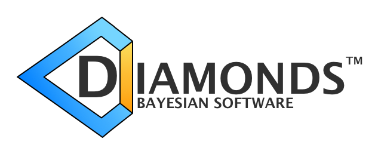

# DIAMONDS and Background - Bayesian Software

 

 

### Authors
- [Enrico Corsaro](mailto:enrico.corsaro@inaf.it)
- [Joris De Ridder](mailto:joris.deridder@kuleuven.be)

### Short description

The <b>DIAMONDS</b> (high-<b>DI</b>mensional <b>A</b>nd multi-<b>MO</b>dal <b>N</b>este<b>D</b> <b>S</b>ampling) code performs a Bayesian parameter estimation and model comparison by means of the nested sampling Monte Carlo (NSMC) algorithm. The code was designed to be generally applicable to a large variety of problems. DIAMONDS is developed in <code class="docutils literal notranslate">C++11</code> and is structured in classes for flexibility and configurability. Any new model, likelihood and prior probability density functions can be defined and implemented, deriving from an abstract class.

The Background extension to DIAMONDS is an extension of the Bayesian inference code DIAMONDS for the fitting of the background signal in the power spectrum of solar-like oscillators. It currently implements many different background models that can be chosen by the user through an input reference name at runtime.

### Download & Installation
Please make sure you read the documentation at [diamonds.readthedocs.io](http://diamonds.readthedocs.io/) before installing and using the code.

### Installation from Git (Linux)

To compile the C++ sources yourself, you should have the following utilities installed:

- git
- gcc
- cmake
- ninja

On Ubuntu, these utilities can be installed if needed by running `sudo apt install git gcc cmake ninja`.

1. First, clone this repository with `git clone` and use the `cd` command to change into the newly cloned directory.
2. Create a build directory and change into it: `mkdir build && cd build`
3. Run cmake to prepare running the compiler: `cmake -GNinja -DCMAKE_CXX_FLAGS=-fopenmp -DCMAKE_EXPORT_COMPILE_COMMANDS=1 -DCMAKE_BUILD_TYPE=Release ..`
   - Tip: Change "Release" to "Debug" to obtain a build with debug symbols, so you can use for example gdb to debug Diamonds and Background.
4. Run ninja to run the compiler: `ninja`

If all goes well and no errors happen in the above steps, the build directory will contain `libdiamonds.so` (a shared library) and `background` (an executable).

--------

Then you should be able to build a demo application by typing `cd demos` and then running

`g++ -o demoSingle2DGaussian demoSingle2DGaussian.cpp -L../build -Wl,-rpath=$PWD/../build -I../include -ldiamonds -std=c++11`

Run the demo by typing `./demoSingle2DGaussian`.

Note - don't remove libdiamonds.so in the build directory and don't move the repository somewhere else on the filesystem,
because that will cause the demo to no longer work!
The reason is that the demoSingle2DGaussian executable knows (using -rpath) that it should look for libdiamonds.so inside the build directory where it currently exists on the filesystem.

### Installation from Git (Mac)

To compile the C++ sources yourself, you should have the following utilities installed:

- git
- clang
- make
- cmake

On a Mac, git, clang and make should already be available;
cmake can be installed with Homebrew by running `sudo brew install cmake`.

1. First, clone this repository with `git clone` and use the `cd` command to change into the newly cloned directory.
2. Create a build directory and change into it: `mkdir build && cd build`
3. Run cmake to prepare running the compiler: `cmake -DCMAKE_EXPORT_COMPILE_COMMANDS=1 -DCMAKE_BUILD_TYPE=Release ..`
   - Tip: Change "Release" to "Debug" to obtain a build with debug symbols, so you can use for example gdb to debug Diamonds and Background.
4. Run ninja to run the compiler: `make -j4`

If all goes well and no errors happen in the above steps, the build directory will contain `libdiamonds.dylib` (a dynamic library) and `background` (an executable).

--------

Then you should be able to build a demo application by typing `cd demos` and then running

`clang++ -o demoSingle2DGaussian demoSingle2DGaussian.cpp -L../build -I ../include -ldiamonds -stdlib=libc++ -std=c++11 -Wno-deprecated-register`

Run the demo by typing `./demoSingle2DGaussian`.

### Tutorials
To run the tutorials provided in the package, please follow the guidelines presented in [tutorials/README.md](https://github.com/EnricoCorsaro/Background/blob/master/tutorials/README.md)
